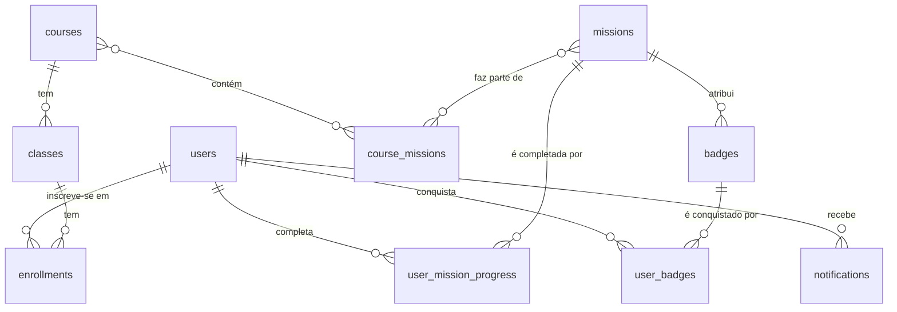

# Arquitetura da Base de Dados - Aplicação "Passaporte Competências Digitais"

Este documento detalha a estrutura da base de dados PostgreSQL, gerida através do Supabase, para a aplicação "Passaporte Competências Digitais" (MVP v1.0).

## Diagrama de Entidade-Relação (ERD)

O diagrama abaixo ilustra as principais entidades e as suas relações:

## Descrição das Tabelas

### Tabela: `users`

Armazena a informação do perfil de cada utilizador, estendendo a tabela `auth.users` do Supabase.

| Coluna | Tipo | Restrições | Descrição |
| :--- | :--- | :--- | :--- |
| `id` | `uuid` | Primary Key, FK para `auth.users.id` | Identificador único do utilizador. |
| `email` | `text` | Not Null, Unique | Email de login do utilizador. |
| `display_name`| `text` | | Nome de exibição do utilizador na plataforma. |
| `avatar_url` | `text` | | URL para a foto de perfil. |
| `total_points`| `integer` | Not Null, Default: 0 | Total de pontos cumulativos do utilizador. |

### Tabela: `courses`

Define os cursos ou "planos de estudo" disponíveis no catálogo.

| Coluna | Tipo | Restrições | Descrição |
| :--- | :--- | :--- | :--- |
| `id` | `serial` | Primary Key | Identificador único numérico do curso. |
| `course_code` | `text` | Unique | O identificador curto e único do curso (ex: "PASS10"). |
| `title` | `text` | Not Null | O título completo do curso. |
| `description` | `text` | | Descrição curta para o card no catálogo. |
| `full_description`| `text` | | Descrição completa para a página do curso. |
| `image_url` | `text` | | URL para a imagem de capa do curso. |
| `requires_code` | `boolean` | Not Null, Default: true | Se `true`, requer inscrição numa turma com código. Se `false`, é de acesso livre. |

### Tabela: `classes`

Gere as instâncias específicas de um curso (as "turmas").

| Coluna | Tipo | Restrições | Descrição |
| :--- | :--- | :--- | :--- |
| `id` | `serial` | Primary Key | Identificador único da turma. |
| `course_id` | `integer`| FK para `courses.id` | Liga à "planta" do curso correspondente. |
| `class_code`| `text` | Unique | O código de acesso único desta turma (ex: "LISBOA24-T3"). |
| `start_date`| `date` | | Data de início da turma. |
| `end_date` | `date` | | Data de fim da turma. |
| `location` | `text` | | Local onde decorre a formação. |
| `facilitators`| `text` | | Nomes dos formadores responsáveis pela turma. |

### Tabela: `missions`

Armazena o conteúdo de cada missão de aprendizagem, que pode ser reutilizado em vários cursos.

| Coluna | Tipo | Restrições | Descrição |
| :--- | :--- | :--- | :--- |
| `id` | `serial` | Primary Key | Identificador único da missão. |
| `title` | `text` | Not Null | O título da missão. |
| `rise_html_content` | `text` | | O conteúdo HTML completo da missão (inspirado no estilo do Articulate Rise 360), armazenado diretamente na base de dados. |

### Tabela: `course_missions`

Tabela de ligação que estabelece a relação muitos-para-muitos entre `courses` e `missions`.

| Coluna | Tipo | Restrições | Descrição |
| :--- | :--- | :--- | :--- |
| `course_id` | `integer`| Primary Key, FK para `courses.id` | Identificador do curso. |
| `mission_id`| `integer`| Primary Key, FK para `missions.id` | Identificador da missão. |
| `mission_order`| `integer`| Not Null | A ordem em que esta missão aparece neste curso específico. |

### Tabela: `enrollments`

Regista a inscrição de um utilizador numa turma específica.

| Coluna | Tipo | Restrições | Descrição |
| :--- | :--- | :--- | :--- |
| `user_id` | `uuid` | Primary Key, FK para `users.id` | Identificador do utilizador. |
| `class_id`| `integer`| Primary Key, FK para `classes.id` | Identificador da turma. |
| `status` | `text` | | Estado da inscrição (ex: 'pendente', 'ativo', 'concluído'). |
| `enrolled_at`| `timestamp`| Not Null, Default: now() | Data e hora da inscrição. |

### Tabela: `user_mission_progress`

Regista a conclusão de uma missão por um utilizador.

| Coluna | Tipo | Restrições | Descrição |
| :--- | :--- | :--- | :--- |
| `user_id` | `uuid` | Primary Key, FK para `users.id` | Identificador do utilizador. |
| `mission_id`| `integer`| Primary Key, FK para `missions.id` | Identificador da missão. |
| `completed_at`| `timestamp`| Not Null, Default: now() | Data e hora de conclusão. |

### Tabela: `badges`

Define todas as medalhas digitais que podem ser conquistadas.

| Coluna | Tipo | Restrições | Descrição |
| :--- | :--- | :--- | :--- |
| `id` | `serial` | Primary Key | Identificador único do badge. |
| `mission_id`| `integer`| FK para `missions.id` | A missão que atribui este badge ao ser concluída. |
| `name` | `text` | Not Null | O nome do badge (ex: "Detetive Digital"). |
| `description` | `text` | | Descrição do que foi feito para o ganhar. |
| `icon_url` | `text` | | URL para a imagem da medalha. |
| `external_badge_url`| `text` | | Link para a plataforma externa (Lisboa Cidade da Aprendizagem). |
| `unlock_instructions` | `text` | | Instruções para o utilizador desbloquear o Open Badge externo. |

### Tabela: `user_badges`

Regista os badges que cada utilizador conquistou.

| Coluna | Tipo | Restrições | Descrição |
| :--- | :--- | :--- | :--- |
| `id` | `serial` | Primary Key | |
| `user_id` | `uuid` | FK para `users.id` | O utilizador que recebeu o badge. |
| `badge_id`| `integer`| FK para `badges.id` | O badge que foi conquistado. |
| `earned_at`| `timestamp`| Not Null, Default: now() | Data e hora da conquista. |

### Tabela: `notifications`

Armazena todas as entradas para o "Activity Feed" da Community Sidebar.

| Coluna | Tipo | Restrições | Descrição |
| :--- | :--- | :--- | :--- |
| `id` | `serial` | Primary Key | Identificador único da notificação. |
| `recipient_user_id`|`uuid` | FK para `users.id` | O utilizador que **recebe** a notificação. |
| `actor_user_id`|`uuid` | FK para `users.id` | O utilizador que **realizou** a ação (pode ser nulo). |
| `type` | `text` | Not Null | Tipo de notificação (ex: 'mission\_completed', 'badge\_received'). |
| `related_badge_id`|`integer`| FK para `badges.id` | Opcional: o ID do badge relacionado. |
| `points_amount`|`integer`| | Opcional: a quantidade de pontos envolvida. |
| `is_read` | `boolean`| Not Null, Default: false | Para saber se o utilizador já viu a notificação. |
| `created_at`|`timestamp`| Not Null, Default: now() | Data e hora em que a notificação foi criada. |

### Tabela: `ui_content`

Armazena o texto da interface da aplicação para permitir edições fáceis sem alterar o código.

| Coluna | Tipo | Restrições | Descrição |
| :--- | :--- | :--- | :--- |
| `key` | `text` | Primary Key | A chave única para identificar o texto (ex: "catalog\_title"). |
| `value` | `text` | | O texto que será apresentado na interface. |
| `description` | `text` | | Opcional: uma nota sobre onde este texto é usado. |
