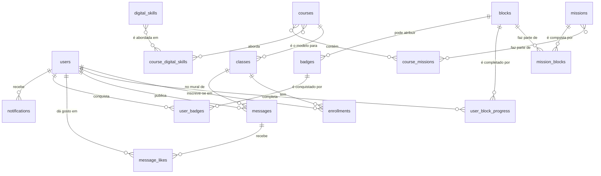

# Arquitetura da Base de Dados - Aplicação "Passaporte Competências Digitais"

===========================================================================

Este documento detalha a estrutura final e completa da base de dados PostgreSQL, gerida através do Supabase. Esta versão reflete uma arquitetura de conteúdo modular e novas entidades para gerir as competências digitais e as interações sociais.

Diagrama de Entidade-Relação (ERD)

----------------------------------

O diagrama abaixo ilustra as principais entidades e as suas relações:

Descrição das Tabelas

---------------------

### Tabelas de Estrutura e Conteúdo

#### Tabela: `digital_skills`

Armazena as 10 competências digitais fundamentais.

| Coluna      | Tipo   | Descrição                                         |

| :---------- | :----- | :------------------------------------------------ |

| `id`        | `serial` | Identificador único da competência.               |

| `title`     | `text` | O nome da competência (ex: "IA e Programação"). |

| `description`| `text` | Uma breve descrição da competência.               |

#### Tabela: `courses`

Define os "planos de estudo" disponíveis no catálogo.

| Coluna             | Tipo      | Restrições              | Descrição                                                                              |

| :----------------- | :-------- | :---------------------- | :------------------------------------------------------------------------------------- |

| `id`               | `serial`  | Primary Key             | Identificador único do curso.                                                          |

| `course_code`      | `text`    | Unique                  | O identificador curto e único do curso (ex: "PASS10").                                 |

| `title`            | `text`    | Not Null                | O título completo do curso.                                                            |

| `description`      | `text`    |                         | Descrição curta para o card no catálogo.                                               |

| `full_description` | `text`    |                         | Descrição completa para a página do curso.                                             |

| `image_url`        | `text`    |                         | URL para a imagem de capa do curso.                                                    |

| `requires_code`    | `boolean` | Not Null, Default: true | Se `true`, requer inscrição numa turma com código. Se `false`, é de acesso livre.    |

| `is_active`        | `boolean` | Not Null, Default: true | Indica se o curso está ativo e deve ser listado no catálogo.                         |

#### Tabela: `course_digital_skills`

Tabela de ligação que estabelece a relação muitos-para-muitos entre `courses` e `digital_skills`.

| Coluna      | Tipo      | Restrições                        | Descrição                                 |

| :---------- | :-------- | :-------------------------------- | :---------------------------------------- |

| `course_id` | `integer` | Primary Key, FK para `courses.id` | Identificador do curso.                   |

| `skill_id`  | `integer` | Primary Key, FK para `digital_skills.id` | Identificador da competência digital.    |

#### Tabela: `classes`

Gere as instâncias específicas de um curso (as "turmas").

| Coluna         | Tipo      | Restrições              | Descrição                                                  |

| :------------- | :-------- | :---------------------- | :--------------------------------------------------------- |

| `id`           | `serial`  | Primary Key             | Identificador único da turma.                              |

| `course_id`    | `integer` | FK para `courses.id`    | Liga à "planta" do curso correspondente.                   |

| `class_code`   | `text`    | Unique                  | O código de acesso único desta turma (ex: "LISBOA24-T3").  |

| `start_date`   | `date`    |                         | Data de início da turma.                                   |

| `end_date`     | `date`    |                         | Data de fim da turma.                                      |

| `location`     | `text`    |                         | Local onde decorre a formação.                             |

| `facilitators` | `text`    |                         | Nomes dos formadores responsáveis pela turma.              |

| `is_active`    | `boolean` | Not Null, Default: true | Indica se a turma está ativa.                              |

#### Tabela: `missions`

Define as missões de aprendizagem.

| Coluna  | Tipo   | Descrição                                           |

| :------ | :----- | :-------------------------------------------------- |

| `id`    | `serial` | Identificador único da missão.                      |

| `title` | `text` | O título da missão (ex: "Missão 1: O Que é a IA?"). |

#### Tabela: `blocks` (Atualizada)

A tabela central para todo o conteúdo, agora com metadados para gestão dinâmica.

| Coluna               | Tipo      | Descrição                                                                  |

| :------------------- | :-------- | :------------------------------------------------------------------------- |

| `id`                 | `serial`  | Identificador único do bloco.                                              |

| `title`              | `text`    | Título interno do bloco para referência.                                   |

| `category`           | `text`    | Categoria do bloco (`aprender`, `descobrir`, `desafio`, `partilha`).       |

| `tags`               | `text[]`  | Etiquetas para o bloco (ex: `{'presencial', 'online', 'em grupo'}`).     |

| `points_reward`      | `integer` | Pontos que o utilizador ganha ao completar o bloco.                          |

| `block_html_content` | `text`    | O conteúdo HTML completo e auto-suficiente do bloco.                       |

#### Tabela: `mission_blocks`

Tabela de ligação que define que blocos compõem cada missão e em que ordem.

| Coluna        | Tipo      | Descrição                                        |

| :------------ | :-------- | :----------------------------------------------- |

| `mission_id`  | `integer` | Identificador da missão.                         |

| `block_id`    | `integer` | Identificador do bloco.                          |

| `block_order` | `integer` | A ordem em que este bloco aparece na missão.     |

#### Tabela: `course_missions`

Tabela de ligação que estabelece a relação muitos-para-muitos entre `courses` e `missions`.

| Coluna          | Tipo      | Restrições                           | Descrição                                                    |

| :-------------- | :-------- | :----------------------------------- | :----------------------------------------------------------- |

| `course_id`     | `integer` | Primary Key, FK para `courses.id`    | Identificador do curso.                                      |

| `mission_id`    | `integer` | Primary Key, FK para `missions.id`   | Identificador da missão.                                     |

| `mission_order` | `integer` | Not Null                             | A ordem em que esta missão aparece neste curso específico.   |

### Tabelas de Utilizadores e Interações

#### Tabela: `users`

Armazena os perfis dos utilizadores.

| Coluna         | Tipo      | Restrições                          | Descrição                                                    |

| :------------- | :-------- | :---------------------------------- | :----------------------------------------------------------- |

| `id`           | `uuid`    | Primary Key, FK para `auth.users.id`  | Identificador único do utilizador.                           |

| `email`        | `text`    | Not Null, Unique                    | Email de login.                                              |

| `display_name` | `text`    |                                     | Nome de exibição do utilizador.                              |

| `avatar_url`   | `text`    |                                     | URL para a foto de perfil.                                   |

| `total_points` | `integer` | Not Null, Default: 0                | Total de pontos cumulativos.                                 |

#### Tabela: `messages`

Armazena as mensagens dos "Pontos de Partilha" e murais sociais.

| Coluna       | Tipo        | Descrição                                         |

| :----------- | :---------- | :------------------------------------------------ |

| `id`         | `serial`    | Identificador único da mensagem.                  |

| `user_id`    | `uuid`      | O autor da mensagem.                              |

| `class_id`   | `integer`   | A turma em que a mensagem foi partilhada.         |

| `block_id`   | `integer`   | O bloco de "Partilha" que originou a mensagem.    |

| `content`    | `text`      | O texto da mensagem.                              |

| `created_at` | `timestamp` | Data e hora da partilha.                          |

#### Tabela: `message_likes`

Regista os "gostos" que cada mensagem recebe.

| Coluna     | Tipo      | Restrições                          | Descrição                              |

| :--------- | :-------- | :---------------------------------- | :------------------------------------- |

| `message_id` | `integer` | Primary Key, FK para `messages.id`  | A mensagem que recebeu o gosto.        |

| `user_id`  | `uuid`    | Primary Key, FK para `users.id`     | O utilizador que deu o gosto.          |

#### Tabela: `badges` (Modificada)

A ligação agora é feita ao bloco que atribui o badge.

| Coluna                | Tipo      | Restrições           | Descrição                                                                      |

| :-------------------- | :-------- | :------------------- | :----------------------------------------------------------------------------- |

| `id`                  | `serial`  | Primary Key          | Identificador único do badge.                                                  |

| `block_id`            | `integer` | FK para `blocks.id`  | (Opcional) O bloco que, ao ser concluído, atribui este badge.                |

| `name`                | `text`    | Not Null             | O nome do badge (ex: "Detetive Digital").                                    |

| `description`         | `text`    |                      | Descrição do que foi feito para o ganhar.                                      |

| `icon_url`            | `text`    |                      | URL para a imagem da medalha.                                                  |

| `external_badge_url`  | `text`    |                      | Link para a plataforma Lisboa Cidade da Aprendizagem.                          |

| `unlock_instructions` | `text`    |                      | Instruções para o desbloqueio do Open Badge.                                   |

#### Tabela: `enrollments`

Regista a inscrição de um utilizador numa turma específica.

| Coluna        | Tipo        | Restrições                          | Descrição                                                    |

| :------------ | :---------- | :---------------------------------- | :----------------------------------------------------------- |

| `user_id`     | `uuid`      | Primary Key, FK para `users.id`     | Identificador do utilizador.                                 |

| `class_id`    | `integer`   | Primary Key, FK para `classes.id`   | Identificador da turma.                                      |

| `status`      | `text`      |                                     | Estado da inscrição (ex: 'pendente', 'ativo', 'concluído'). |

| `enrolled_at` | `timestamp` | Not Null, Default: now()            | Data e hora da inscrição.                                    |

#### Tabela: `user_block_progress` (Nova)

Regista a conclusão de cada bloco individual por um utilizador.

| Coluna         | Tipo        | Restrições                          | Descrição                                       |

| :------------- | :---------- | :---------------------------------- | :---------------------------------------------- |

| `user_id`      | `uuid`      | Primary Key, FK para `users.id`     | Identificador do utilizador.                    |

| `block_id`     | `integer`   | Primary Key, FK para `blocks.id`    | Identificador do bloco.                         |

| `completed_at` | `timestamp` | Not Null, Default: now()            | Data e hora de conclusão.                       |

#### Tabela: `user_badges`

Regista os badges que cada utilizador conquistou.

| Coluna      | Tipo        | Restrições              | Descrição                                       |

| :---------- | :---------- | :---------------------- | :---------------------------------------------- |

| `id`        | `serial`    | Primary Key             |                                                 |

| `user_id`   | `uuid`      | FK para `users.id`      | O utilizador que recebeu o badge.               |

| `badge_id`  | `integer`   | FK para `badges.id`     | O badge que foi conquistado.                    |

| `earned_at` | `timestamp` | Not Null, Default: now()| Data e hora da conquista.                       |

#### Tabela: `notifications`

Armazena todas as entradas para o "Activity Feed" da Community Sidebar.

| Coluna               | Tipo        | Restrições                 | Descrição                                                                      |

| :------------------- | :---------- | :------------------------- | :----------------------------------------------------------------------------- |

| `id`                 | `serial`    | Primary Key                | Identificador único da notificação.                                            |

| `recipient_user_id`  | `uuid`      | FK para `users.id`         | O utilizador que **recebe** a notificação.                                     |

| `actor_user_id`      | `uuid`      | FK para `users.id`         | O utilizador que **realizou** a ação (pode ser nulo).                          |

| `type`               | `text`      | Not Null                   | Tipo de notificação (ex: 'block_completed', 'badge_earned', 'message_liked').  |

| `related_block_id`   | `integer`   | FK para `blocks.id`        | Opcional: o ID do bloco relacionado.                                           |

| `related_badge_id`   | `integer`   | FK para `badges.id`        | Opcional: o ID do badge relacionado.                                           |

| `related_message_id` | `integer`   | FK para `messages.id`      | Opcional: o ID da mensagem relacionada.                                        |

| `points_amount`      | `integer`   |                            | Opcional: a quantidade de pontos envolvida.                                    |

| `is_read`            | `boolean`   | Not Null, Default: false   | Para saber se o utilizador já viu a notificação.                               |

| `created_at`         | `timestamp` | Not Null, Default: now()   | Data e hora em que a notificação foi criada.                                   |
